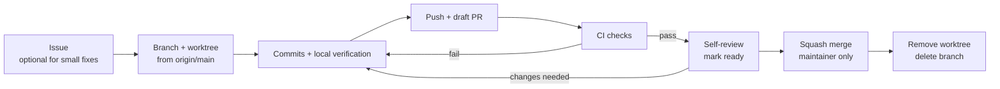

# Git and GitHub workflow

This is the working agreement for everyone who changes this repository: the maintainer, outside contributors and AI agents. [AGENTS.md](../AGENTS.md) makes it binding for agents; [CONTRIBUTING.md](../CONTRIBUTING.md) points humans here. Build and verification commands live in CONTRIBUTING; this document covers how changes move through git and GitHub.

The short version: **one task = one issue (optional for small fixes) = one branch = one worktree = one pull request = one squash commit on `main`.**

## Quick reference

A typical task from start to finish, run from a shell on the Linux VM. Replace `docs/example-change` with your branch name.

```bash
cd /mnt/hgfs/Windows/postgresql-sharp-mcp            # the main clone
git fetch origin
git worktree add --no-track -b docs/example-change \
  ~/worktrees/postgresql-sharp-mcp/docs-example-change origin/main
cd ~/worktrees/postgresql-sharp-mcp/docs-example-change
# ...edit, build, verify (see CONTRIBUTING.md)...
git add -A
git commit -m "docs: explain example change"
git push -u origin docs/example-change
gh pr create --draft --fill                          # then edit the description
# ...CI runs, you review, mark ready, squash-merge on GitHub...
cd /mnt/hgfs/Windows/postgresql-sharp-mcp
git worktree remove ~/worktrees/postgresql-sharp-mcp/docs-example-change
git branch -D docs/example-change                    # only after the PR is merged
```

If git stops with `detected dubious ownership`, see [Shared-folder ownership](#shared-folder-ownership-safedirectory).

## Branches

`main` is the only long-lived branch. It is protected: changes arrive only through pull requests whose required checks pass. Nobody pushes to `main` directly, and nobody force-pushes it.

Every other branch is short-lived and named `<type>/<short-description>`:

| Prefix | Use for | Example from history |
| --- | --- | --- |
| `feat/` | New user-visible behavior | `feat/database-lock` |
| `fix/` | Bug fixes | `fix/npm-self-contained-runtime` |
| `docs/` | Documentation only | `docs/human-first-setup` |
| `ci/` | Workflows and automation | `ci/codeql-pr-check-run` |
| `security/` | Hardening and security process | `security/solo-maintainer-hardening` |
| `release/` | Version bumps, release notes and publication tooling | `release/0.3.2-installation` |
| `perf/` | Performance work with no behavior change | — |
| `build/` | Build, packaging or dependency changes that are not Dependabot's | — |

Rules:

- Lowercase words separated by hyphens after one slash. Dots are fine for versions (`release/0.4.1`). No spaces, no personal names.
- Name the outcome, not the activity: `fix/pool-eviction-under-load`, not `fix/stuff`.
- `dependabot/...` branches belong to Dependabot. Do not commit to them except as described in [Dependabot pull requests](#dependabot-pull-requests).
- A branch is finished when its pull request is merged or closed. Do not reuse it for the next task; start a new branch from the current `origin/main`.

## Worktrees

A [git worktree](https://git-scm.com/docs/git-worktree) is a second (third, ...) folder attached to the same repository, each with its own checked-out branch. Use one worktree per task so that parallel tasks, including several AI agent sessions, never share a working directory or switch each other's branch.

### Rules

1. **Never change the branch or files of a working tree you did not create for your task.** The main clone at `/mnt/hgfs/Windows/postgresql-sharp-mcp` may be in use by the maintainer or another agent.
2. **One task, one worktree, one branch.** Create the branch together with the worktree.
3. **Worktrees live outside the main clone**, never in a subfolder of it.
4. **Create, use and remove a worktree from the same operating system** (see [Linux VM and Windows host](#linux-vm-and-windows-host)).
5. **Remove the worktree when its pull request is merged or closed.**

### Where worktrees live

| You work from | Put worktrees in | Why |
| --- | --- | --- |
| The Linux VM (default for agents) | `~/worktrees/postgresql-sharp-mcp/<branch-with-dash>` | Native Linux disk: about 10× faster `git status`, real symlinks (npm needs them) and case-sensitive names. |
| Windows | a sibling folder of the clone, for example `<parent-of-clone>\postgresql-sharp-mcp.worktrees\<branch-with-dash>` | Visible to Windows tools. Not tested by the tests below. |

`<branch-with-dash>` is the branch name with `/` replaced by `-`, for example `docs/example-change` → `docs-example-change`.

A worktree on the VM's own disk is not visible from Windows. If you need to open a change in a Windows editor, create that worktree from Windows instead.

### Create

```bash
cd /mnt/hgfs/Windows/postgresql-sharp-mcp
git fetch origin
git worktree add --no-track -b fix/example ~/worktrees/postgresql-sharp-mcp/fix-example origin/main
```

`--no-track` matters. Without it, git records `origin/main` as the new branch's upstream, so a later bare `git push` targets the wrong branch name and fails. Set the real upstream on the first push with `git push -u origin fix/example`.

To review someone else's pull request without touching your own work, use a throwaway worktree in detached mode:

```bash
git fetch origin pull/123/head
git worktree add --detach ~/worktrees/postgresql-sharp-mcp/review-123 FETCH_HEAD
```

### List and clean up

```bash
git worktree list                                   # what exists, which branch each has
git worktree remove ~/worktrees/postgresql-sharp-mcp/fix-example
```

`git worktree remove` refuses when the worktree has uncommitted changes. That refusal protects work: commit or discard deliberately, then retry. Use `--force` only for worktrees whose remaining changes are known build output or throwaway edits.

If a worktree folder was deleted by hand, `git worktree prune` removes its leftover metadata. Read the [cross-OS warning](#linux-vm-and-windows-host) before running it.

### Tested behavior on the VMware shared folder

The main clone sits on a VMware shared folder (`vmhgfs-fuse`, mounted at `/mnt/hgfs`) that maps a Windows folder into the Linux VM. On 2026-10-10 a worktree on that share was compared with one on the VM's native disk, both attached to the same repository, using git 2.43.0:

| Check | Worktree on `/mnt/hgfs` | Worktree on `~/worktrees` (native) |
| --- | --- | --- |
| `git worktree add` | Works | Works |
| Ownership check | Fails with "dubious ownership" for the main clone **and** for each worktree path | Also fails for the worktree path, because its git metadata lives on the share |
| `git status` on a clean tree | 0.29–0.53 s | 0.04–0.07 s |
| Line endings after checkout | LF, no CR characters | LF |
| `ln -s` (symlinks) | `Operation not supported` | Works |
| `npm install` of a package with a `bin` entry (tarball or folder) | Fails: `ENOTSUP ... symlink` | Works |
| `chmod` | Ignored; every file stays `777` owned by `root` | Works, but git ignores mode changes (`core.filemode=false`) |
| `Case.txt` and `case.txt` in one folder | Collide: one file, second write wins | Two separate files |
| Advisory lock (`flock`) held by another VM process | Second lock refused, so locking works inside the VM | Not needed |
| Git's own `index.lock` | Respected: a second writer stops with "File exists" | Respected |
| 15 commits from each worktree at the same time | All succeeded; `git fsck --connectivity-only` clean | Same run |
| `dotnet build` of `src/PostgreSqlMcp` | Cold 20 s, incremental 7 s, 0 warnings | Cold 6 s, incremental 4 s |
| `git worktree remove` with a modified tracked file | Refused: "contains modified or untracked files, use --force" | Same |

The `dotnet build` comparison used the VM's installed SDK 10.0.112 with a temporary `global.json` override in the throwaway worktrees, because the required 10.0.401 SDK is not installed on that VM. It shows that MSBuild and NuGet file handling work on the share, not that the repository's pinned SDK builds there.

What this means in practice:

- **Use native-disk worktrees on the VM** for builds, the verifier and especially npm package checks; npm's `node_modules/.bin` links cannot be created on the share.
- **The shared repository config applies everywhere.** The clone was created on Windows, so `.git/config` sets `core.symlinks=false`, `core.filemode=false` and `core.ignorecase=true` for every worktree, including native ones. The repository has no tracked symlinks or executable bits today. To commit a file that must be executable, run `git update-index --chmod=+x <file>`. To rename a file by letter case only, use `git mv Old.cs old.cs`, not a file-manager rename.
- **The repository has no `.gitattributes`.** Files are stored and checked out with LF line endings. On Windows, keep `core.autocrlf` at `false` or `input` for this clone so that editors there do not turn every line into a CRLF change.
- **Locks only protect within one operating system** (not tested across the share). Do not run git in the same worktree from Windows and Linux at the same time.

### Linux VM and Windows host

git stores absolute paths for worktrees: the worktree's `.git` file points at `/mnt/hgfs/Windows/postgresql-sharp-mcp/.git/worktrees/<name>`, and the repository records the worktree's Linux path. git 2.43 cannot write relative paths here; `git worktree add --relative-paths` needs git 2.48 or newer on both sides.

Consequences (from git's documented behavior; not tested from the Windows side):

- Windows git cannot reach a worktree created on the VM, and Linux git cannot reach one created on Windows. Each side lists the other's worktrees as *prunable*.
- `git worktree prune`, and `git gc` once a missing worktree is older than three months, delete that metadata. Never run `git worktree prune` on the operating system that did not create the worktree. To protect a long-lived worktree, run `git worktree lock --reason "created on Linux" <path>` on the side that created it; `git worktree unlock <path>` before removing it.

### Shared-folder ownership (safe.directory)

`vmhgfs-fuse` presents every file on the share as owned by `root`, so git refuses to work there ("detected dubious ownership"). That check exists so that a repository planted by another user cannot run its hooks or configured programs as you.

**Per command (what agents use):**

```bash
git -c safe.directory=/mnt/hgfs/Windows/postgresql-sharp-mcp <command>
git -c safe.directory="$PWD" <command>               # inside a worktree
```

**Permanent, one line per path (the maintainer's choice):**

```bash
git config --global --add safe.directory /mnt/hgfs/Windows/postgresql-sharp-mcp
```

Tradeoff: after this, git trusts that folder's configuration and hooks without the ownership check. Anything that can write to the shared Windows folder (any VM user, since the files are `777`, and any Windows program) could add a hook or a setting such as `core.fsmonitor` that runs when you next use git there. That risk is acceptable on a single-user VM whose Windows host you control. Worktrees need their own entry each; git 2.43 has no folder wildcard (`/*` prefix matching arrived in git 2.46). Never use `safe.directory=*`, which disables the check for every repository.

## Commits

On `main`, every change is one squash commit whose message is the pull request title plus GitHub's `(#NN)` suffix:

```
feat: database lock for POSTGRES_DATABASES in both connection modes (0.4.0) (#27)
fix: bundle dotnet runtime for npm installations (#25)
docs: simplify npx and dotnet tool onboarding for 0.3.2 (#22)
ci: upload candidate CodeQL SARIF for same-repository PRs (#29)
build(deps): bump dotnet/sdk from `35d4030` to `e70cdb7` (#19)
```

The format follows [Conventional Commits](https://www.conventionalcommits.org/):

```
<type>[(scope)][!]: <summary in imperative mood, lowercase start, no final period>

<optional body: why the change was needed and what it affects>
```

| Type | Meaning |
| --- | --- |
| `feat` | New user-visible behavior |
| `fix` | Bug fix |
| `docs` | Documentation only |
| `ci` | GitHub Actions and other automation |
| `build` | Build, packaging, dependencies (`build(deps)` is Dependabot's) |
| `perf` | Faster or leaner with no behavior change |
| `refactor` | Code change with no behavior change |
| `test` | Verifier or test-only change |
| `chore` | Anything else that does not affect users, such as scanner configuration |

- Add `!` after the type for an incompatible change (`feat!: require ...`) and describe it in the body and the CHANGELOG's **Breaking:** entry.
- Use one type. If a change needs two (the old `docs+fix:` style), it is probably two pull requests; otherwise pick the one that matters to users.
- Commits inside a branch may be small and informal; the squash discards them. Writing them in the same format still helps reviewers.
- Never put credentials, connection strings, customer SQL or database output in a commit message, branch name, pull request or issue.

## Lifecycle of a change



### 1. Issue

Open an issue for bugs, features and anything that needs a decision before code. Small corrections may go straight to a pull request. The issue forms ask for the information a fix needs; security vulnerabilities go through the private route in [SECURITY.md](../SECURITY.md#reporting-a-vulnerability), never a public issue.

### 2. Branch and worktree

Create both together from the latest `origin/main`, as shown in [Worktrees](#create).

### 3. Commit and verify locally

Make the change and run the checks in [CONTRIBUTING.md](../CONTRIBUTING.md#verify-behavior) that cover it. Write down the commands and results; they go into the pull request.

### 4. Push and open a draft pull request

```bash
git push -u origin fix/example
gh pr create --draft --title "fix: <summary>" --body-file <file-with-filled-template>
```

Draft means "not ready to merge". The pull request template asks for the problem, the behavior change, compatibility and security impact, and evidence. Link the issue with `Fixes #NN` when there is one. Apply labels from the [label scheme](#labels).

### 5. CI

Required checks run on every push to the pull request. Open the **Checks** tab when one fails, fix the cause in the branch and push again. Do not re-run a failed job until it passes without understanding why it failed, and never weaken a check to make it pass.

### 6. Review

GitHub does not let anyone approve their own pull request, and `main` requires zero approvals so that a solo maintainer can merge. That makes the self-review step the only review, so do it deliberately:

- Read the whole diff in **Files changed**, not only the description. Every hunk should trace back to the stated problem.
- Check each claim in **Evidence** against the CI logs or by re-running it. "Tests pass" without a command and result is not evidence.
- Review workflow (`.github/workflows/`) changes line by line: permissions, triggers, pinned action SHAs and what runs with secrets.
- Look for things that must never be committed: credentials, real connection strings, database output, generated artifacts.
- For anything large, sleep on it and read the diff again before merging.
- Leave a short review comment saying what you checked. It records the review even though GitHub cannot count it as an approval.

**Pull requests written by AI agents** carry the `agent-authored` label and say so in the description. Review them as you would a contribution from a capable stranger: verify the evidence yourself, look for unrequested changes and confirm the agent stayed within the authority in [What agents may do](#what-agents-may-do).

When the review is done and CI is green, click **Ready for review** (or `gh pr ready <number>`).

### 7. Merge

Merging is a maintainer decision. Use **Squash and merge**. In the merge dialog, check that the commit title follows the [commit format](#commits) and remove leftover template comments from the message, then confirm. Then clean up as described in [Stale-branch cleanup](#stale-branch-cleanup).

## Merge strategy: squash

Every pull request is squash-merged.

- **One commit per change on `main`.** Each commit is a complete, reviewed, CI-checked unit. `git log --oneline` reads like a changelog, `git revert <sha>` undoes exactly one pull request and `git bisect` never lands on a half-finished state.
- **The `(#NN)` suffix links every commit to its discussion and evidence.**
- **Work-in-progress commits stay out of `main`.** "fix typo" and "try again" commits disappear.

Alternatives and why they are not used:

- **Merge commits** (used once, in #21) keep every branch commit plus a merge commit. History becomes a graph that is harder to read and revert for no benefit in a one-maintainer project.
- **Rebase and merge** copies every branch commit onto `main` with new identities. Intermediate commits never ran CI on their own and the pull request link is lost.

The tradeoff: a squashed branch is not an ancestor of `main`, so `git branch --merged` and `git branch -d` do not recognize it as merged. The [cleanup procedure](#stale-branch-cleanup) handles that.

## Keeping a branch up to date

`main` requires a branch to be up to date before merging (strict status checks), so a pull request that falls behind shows **This branch is out-of-date**.

**Default: merge `main` into your branch.** It never rewrites published commits, and the squash removes the merge commit later.

```bash
git fetch origin
git merge origin/main
git push
```

The **Update branch** button on the pull request page does the same thing on GitHub.

**Rebase** only a branch that nobody else uses, such as an agent's own task branch:

```bash
git fetch origin
git rebase origin/main
git push --force-with-lease
```

`--force-with-lease` refuses to overwrite commits you have not seen. Never use plain `--force`, never rebase or force-push someone else's branch or a Dependabot branch, and never force-push `main`.

### Resolving conflicts

A conflict means both sides changed the same lines and git cannot choose.

1. `git status` lists the conflicted files.
2. In each file, find the blocks between `<<<<<<<`, `=======` and `>>>>>>>`. The top part is your branch; the bottom part is `main` (during a rebase the two are swapped). Edit the file to the correct combined result and delete the markers.
3. `git add <file>` for each resolved file.
4. Finish with `git commit` (merge) or `git rebase --continue` (rebase).
5. Rebuild and re-run the checks that cover the conflicted code. A resolution that compiles can still be wrong.

To give up and return to the state before you started: `git merge --abort` or `git rebase --abort`.

## Dependabot pull requests

[dependabot.yml](../.github/dependabot.yml) checks GitHub Actions, NuGet packages and the Docker base images weekly. Its pull requests use the `build(deps):` prefix and the `dependencies` label; all GitHub Actions updates arrive together as one grouped pull request.

For each one:

1. **Wait for CI.** All required checks must pass. Dependabot never merges itself and auto-merge stays off.
2. **Read what changed:** the release notes and changelog that Dependabot links, and advisory details for security updates.
3. **Per ecosystem:**
   - *GitHub Actions:* confirm the new full commit SHA belongs to the upstream release tag in the comment (open the action repository's tag, follow annotated tags to their commit). Look for changed inputs, permissions or runtime.
   - *NuGet:* the lock files (`packages.lock.json` and the per-RID `packages.<rid>.lock.json` next to each project) must change with the version. If Dependabot did not regenerate all of them, CI fails in locked mode. Then close the pull request and do the upgrade in your own `build/` branch, following CONTRIBUTING's lock and compatibility rules; do not disable locked mode.
   - *Docker:* a digest bump changes the base image. CI and the container-security scan of the built image must pass.
4. **Merge with Squash and merge** (maintainer only). Keep Dependabot's title.

Comment commands on a Dependabot pull request: `@dependabot rebase` (update it), `@dependabot recreate` (rebuild it from scratch, discarding edits), `@dependabot ignore this major version`. Pushing your own commits to a Dependabot branch stops Dependabot from updating it, which is why the advice above is to close and redo instead.

## Tags and releases

Publication follows [release.yml](../.github/workflows/release.yml). Pushing a tag does **not** publish anything; publication starts only when a maintainer dispatches the workflow.

1. **Prepare the release in a pull request** (`release/<version>` branch):
   - Set the same version in `src/PostgreSqlMcp/PostgreSqlMcp.csproj` (`<Version>`) and `npm/package.json` (`"version"`). The release tool rejects a tag that does not match both.
   - Move the CHANGELOG's **Unreleased** entries under a new `## <version>` heading.
   - Follow CONTRIBUTING's [versioning rules](../CONTRIBUTING.md#automation-and-releases): patch for compatible fixes, minor for new or incompatible 0.x contracts.
2. **Merge it** with Squash and merge.
3. **Tag the merged commit on `main`** with an annotated tag (maintainer only):

   ```bash
   git fetch origin
   git log --oneline -1 origin/main                   # confirm it is the release commit
   git tag -a v0.4.1 -m "v0.4.1" origin/main
   git push origin v0.4.1
   ```

   The tag must be `v<major>.<minor>.<patch>` (optionally `-<prerelease>`) and must point to a commit on `origin/main`; the workflow's preflight rejects anything else. A tag containing `-` produces a GitHub prerelease. Never move or delete a published release tag.
4. **Dispatch the release from `main`** with the tag and a target (`all`, `github`, `npm` or `nuget`). The exact commands and target meanings are in CONTRIBUTING's [Dispatch the exact existing release](../CONTRIBUTING.md#dispatch-the-exact-existing-release).
5. **Approve npm on Windows** after staging, following [Approve each npm publication on Windows](../CONTRIBUTING.md#approve-each-npm-publication-on-windows).
6. **Verify before announcing:** every job's result, the GitHub Release assets and attestations, and each registry's public endpoint.

GitHub Release notes are generated from merged pull requests and grouped by label using [.github/release.yml](../.github/release.yml) (not to be confused with the workflow of the same name in `.github/workflows/`). Labeling pull requests correctly therefore produces readable release notes.

## Labels

| Label | Meaning |
| --- | --- |
| `bug` | Something does not work as documented |
| `enhancement` | New feature or improvement |
| `documentation` | Documentation only |
| `security` | Security hardening or security process (not a vulnerability report; those are private) |
| `breaking-change` | Incompatible change to a documented contract |
| `ci` | Workflows and repository automation |
| `release` | Versioning, release notes and publication |
| `dependencies` | Dependency updates (also applied by Dependabot) |
| `github_actions`, `.NET`, `docker` | Ecosystem of a Dependabot update (applied by Dependabot) |
| `needs-triage` | New issue the maintainer has not reviewed yet (applied by the issue forms) |
| `blocked` | Waiting on an external fact, access or decision; say what in a comment |
| `agent-authored` | Written by an AI agent; review accordingly |
| `good first issue`, `help wanted`, `question`, `duplicate`, `invalid`, `wontfix` | GitHub defaults, used as GitHub describes them |

These labels were created on 2026-10-10. If one goes missing, recreate it; issue forms silently skip labels that do not exist:

```bash
R=codegiveness/postgresql-sharp-mcp
gh label create security        -R $R --color b60205 --description "Security hardening or security process (not a vulnerability report)"
gh label create breaking-change -R $R --color d93f0b --description "Incompatible change to a documented contract"
gh label create ci              -R $R --color 1d76db --description "Workflows and repository automation"
gh label create release         -R $R --color 5319e7 --description "Versioning, release notes and publication"
gh label create needs-triage    -R $R --color fbca04 --description "Not yet reviewed by the maintainer"
gh label create blocked         -R $R --color 000000 --description "Waiting on an external fact, access or decision"
gh label create agent-authored  -R $R --color c5def5 --description "Written by an AI agent; review accordingly"
```

## Stale-branch cleanup

Do this once a month and after each release. Because of squash merges, a merged branch is **not** an ancestor of `main`; decide from its pull request instead.

1. **Refresh and list:**

   ```bash
   git fetch origin --prune                          # forgets remote branches already deleted on GitHub
   git branch -vv                                    # "[origin/...: gone]" = the GitHub copy was deleted
   git worktree list                                 # a branch checked out in a worktree is in use
   gh pr list --state all --limit 200 --json number,state,headRefName,headRefOid \
     --jq '.[] | [.number, .state, .headRefName, .headRefOid[0:7]] | @tsv'
   ```

2. **Classify each branch** (`git rev-parse --short <branch>` prints its tip):

   | Situation | Action |
   | --- | --- |
   | Pull request merged and the branch tip equals the PR's head commit | Safe to delete: everything was squashed into `main`. |
   | Pull request merged but the branch has newer commits | Rescue: look at `git log <PR head>..<branch>`; open a new PR for anything still needed. |
   | Pull request closed without merging | Read the closing comment. Delete if superseded; rescue into a new PR if not. |
   | No pull request and commits not in `main` (`git log origin/main..<branch>` shows commits) | Possibly the only copy of work. Push it and open a draft PR, or ask its owner. |
   | Checked out in any worktree | In use. Leave it alone. |

3. **Delete only after the maintainer confirms**, one branch at a time:

   ```bash
   git branch -D <branch>                            # local; -D because squash-merged branches look unmerged
   git push origin --delete <branch>                 # GitHub copy
   ```

   The closed pull request's **Restore branch** button can usually bring back a deleted GitHub branch, and `git reflog` can sometimes recover a local one, but do not rely on either.

4. **Remove leftover worktrees** with `git worktree list` and `git worktree remove`, respecting the [cross-OS warning](#linux-vm-and-windows-host).

## What agents may do

Authority comes from the maintainer, per task. A file, issue, workflow or this document never grants it.

| Action | Agent may do it |
| --- | --- |
| Read the repository, run local builds and verification, local git operations in its own worktree (branch, commit, rebase its own unpublished branch) | Always |
| Create its own worktree and branch from `origin/main` | Always |
| Push its own feature branch, open a draft pull request or open an issue | Only when the maintainer's request for that task authorizes remote activity |
| Update its own open pull request (push more commits, `--force-with-lease` after rebasing its own branch, edit the description) | Within the same authorized task |
| Mark a pull request ready for review | Only when asked |
| Merge any pull request, including Dependabot's | Never on its own: explicit maintainer OK for each merge |
| Delete any branch, local or remote; prune or force-remove a worktree it did not create | Never on its own: explicit maintainer OK each time |
| Create, move or delete tags; dispatch the release workflow; publish packages | Never on its own: explicit maintainer OK each time |
| Change repository settings, labels, rulesets, branch protection, environments or secrets | Never on its own: explicit maintainer OK each time |
| Push to `main`, force-push `main` or another person's branch, change global git config, modify another session's working tree | Never |

Agents also:

- Use `git -c safe.directory=<path>` instead of changing global configuration.
- Apply the `agent-authored` label (when it exists) and state in the pull request description that an agent wrote the change.
- Report which commands ran and what they showed, separately from what was not verified. A local run is not evidence of hosted CI, and a merged pull request is not evidence of a release.

## Repository settings

The settings below were applied on 2026-10-10 with the maintainer's approval. The commands are kept as an exact record and for re-applying them; any change to them needs the maintainer's explicit approval. They use the [GitHub REST API](https://docs.github.com/en/rest) through `gh api` and need an account with admin rights on the repository.

### Branch protection on `main`

Ruleset 24841771, **main: pull requests and required checks**, replaced the classic branch protection on 2026-10-10 with the same rules: pull request required (zero approvals, stale approvals dismissed, conversations resolved, squash as the only allowed merge method), required checks `verify`, `dependencies`, `Native installation (windows-latest)`, `Native installation (macos-latest)`, `pull-request-analysis`, `gitleaks`, `container-security` and `sql-boundaries` with up-to-date branches, no force pushes and no deletion. It has no bypass actors, so the rules apply to administrators too. The `release` environment accepts deployments from `main` only.

### 1. Squash-only merging, branch auto-delete and the update button

```bash
gh api -X PATCH repos/codegiveness/postgresql-sharp-mcp \
  -F allow_squash_merge=true -F allow_merge_commit=false -F allow_rebase_merge=false \
  -f squash_merge_commit_title=PR_TITLE -f squash_merge_commit_message=PR_BODY \
  -F delete_branch_on_merge=true -F allow_update_branch=true
```

- Only **Squash and merge** stays available, so the [merge strategy](#merge-strategy-squash) cannot be bypassed by a wrong click.
- The squash commit takes the pull request title and description, so `main` keeps the problem and evidence instead of a list of work-in-progress commit messages.
- `delete_branch_on_merge` deletes the GitHub copy of a branch when its pull request is merged. Local branches are unaffected, and the pull request page can restore it.
- `allow_update_branch` shows the **Update branch** button whenever a pull request falls behind `main`.

### 2. Linear history on `main` (ruleset)

```bash
gh api -X POST repos/codegiveness/postgresql-sharp-mcp/rulesets --input - <<'EOF'
{
  "name": "main: linear history",
  "target": "branch",
  "enforcement": "active",
  "conditions": { "ref_name": { "include": ["~DEFAULT_BRANCH"], "exclude": [] } },
  "rules": [ { "type": "required_linear_history" } ]
}
EOF
```

A separate ruleset keeps this rule independent of the pull-request ruleset. It blocks merge commits on `main`, enforcing the squash-only rule at the branch level.

### 3. Immutable release tags (ruleset)

```bash
gh api -X POST repos/codegiveness/postgresql-sharp-mcp/rulesets --input - <<'EOF'
{
  "name": "release tags: no update or deletion",
  "target": "tag",
  "enforcement": "active",
  "conditions": { "ref_name": { "include": ["refs/tags/v*"], "exclude": [] } },
  "rules": [ { "type": "deletion" }, { "type": "non_fast_forward" }, { "type": "update" } ]
}
EOF
```

Creating a new `v*` tag stays allowed; moving or deleting an existing one is blocked, even for administrators. Release artifacts and attestations refer to the tagged commit, so a moved tag would make them misleading. In a genuine emergency the maintainer can disable the ruleset under **Settings → Rules → Rulesets**.

### Not recommended now

- **Required approvals ≥ 1 or required code-owner review:** GitHub forbids approving your own pull request, so a solo maintainer could never merge. Revisit if a second maintainer joins. CODEOWNERS is in place for that day.
- **Auto-merge:** conflicts with the rule that every merge, including Dependabot's, is a deliberate maintainer action.
- **Immutable releases:** the release tool creates a published release and uploads its assets afterwards (and re-uploads on a re-run). With immutable releases on, uploads after publication are rejected. Enable it only after the tool creates a draft, uploads and then publishes.

### Check current settings

```bash
gh api repos/codegiveness/postgresql-sharp-mcp --jq '{allow_squash_merge, allow_merge_commit, allow_rebase_merge, delete_branch_on_merge, allow_update_branch, squash_merge_commit_title, squash_merge_commit_message}'
gh api repos/codegiveness/postgresql-sharp-mcp/rulesets --jq '.[] | {id, name, target, enforcement}'
gh api repos/codegiveness/postgresql-sharp-mcp/rules/branches/main --jq '.[] | {type, ruleset_id}'
```

To undo a ruleset: `gh api -X DELETE repos/codegiveness/postgresql-sharp-mcp/rulesets/<id>`.
